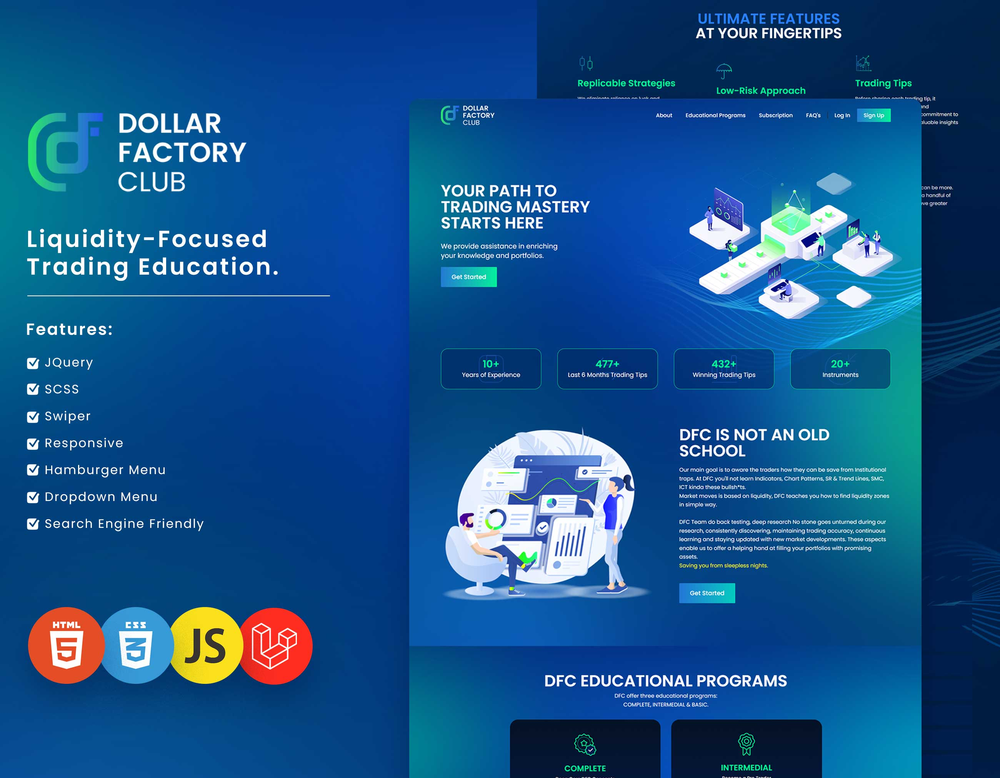

# Dollar Factory Club (DFC) - Empowering Traders Through Liquidity-Based Strategies

DFC is not just another trading education platform; it's a paradigm shift in the way traders approach the markets. Our primary goal is to enlighten traders about institutional traps and equip them with the knowledge to navigate these treacherous waters successfully. At DFC, you won't find the usual arsenal of indicators, chart patterns, support and resistance (SR), trend lines, or other ineffective strategies. We're here to debunk the noise and offer real insights into how the market truly operates.

## What Sets Us Apart

- **Liquidity-Centric Approach**: Unlike traditional methods that often lead traders astray, DFC's foundation is built upon understanding the role of liquidity in driving market movements. Our focus is on teaching traders how to identify liquidity zones, which form the basis of profitable trading strategies.

- **Institutional Trap Awareness**: We empower traders to recognize and sidestep the traps set by institutional players. By unveiling these manipulative tactics, we provide you with the edge needed to thrive in the markets.

- **Research and Backtesting**: The DFC team leaves no stone unturned in our pursuit of trading excellence. Rigorous backtesting and deep research underpin our strategies, ensuring accuracy and reliability in our educational offerings.

- **Continuous Learning**: Markets evolve, and so do we. We stay at the forefront of market developments, ensuring that you receive the latest insights and strategies that stand the test of time.

## Technology Profile

DFC employs cutting-edge technologies to deliver a seamless learning experience:

- [Swiper](https://swiperjs.com/) for dynamic content presentation.
- [jQuery](https://jquery.com/) to enhance interactivity.
- [Video.js](https://videojs.com/) for top-notch video content delivery.
- [Tailwind CSS](https://tailwindcss.com/) for responsive and efficient styling.
- [Poppins](https://fonts.google.com/specimen/Poppins) font family for visually pleasing typography.
- [Swiper CSS](https://swiperjs.com/) to ensure a sleek interface.

## Getting Started

1. Visit our [website](https://dollarfactoryclub.com/) to create an account or log in if you're already a member.
2. Explore our comprehensive educational resources that focus on liquidity zones and institutional dynamics.
3. Engage with interactive content powered by Swiper, jQuery, and Video.js.
4. Benefit from our commitment to research-backed strategies and accurate trading insights.
5. Join us in revolutionizing your trading approach and building a portfolio of promising assets.

## Contributions and Contact

We value contributions from our community. If you have ideas, suggestions, or bug reports, feel free to reach out to us.

- Website: [https://dollarfactoryclub.com/](https://dollarfactoryclub.com/)

Join DFC today and embark on a journey to become a savvy trader who thrives in the world of liquidity-driven markets.

> Saving you from sleepless nights.

## License

⚠️ This project is **NOT FREE** and is **NOT OPEN SOURCE**. All rights to the source code, design, and content are reserved by the project owner.

**Usage of this app is strictly prohibited without explicit written permission from the project owner.**

If you are interested in using, modifying, or distributing this project, please contact the project owner at muhammadshiraz996@gmail.com to inquire about licensing and usage terms.

This README.md file and its content are for illustration purposes only and should not be used or distributed without permission.

---

Thank you for checking out our Dollar Factory Group App! For any inquiries or further information, feel free to [contact us](mailto:muhammadshiraz996@gmail.com).